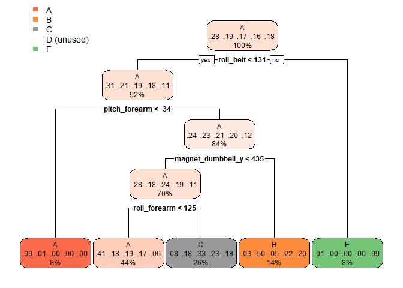

## R Markdown
# Objectives

###The goal of your project is to predict the manner in which they did the exercise. This is the "classe" variable in the training set. You may use any of the other variables to predict with. You should create a report describing how you built your model, how you used cross validation, what you think the expected out of sample error is, and why you made the choices you did. You will also use your prediction model to predict 20 different test cases. I used data from accelerometers on the belt, forearm, arm, and dumbell of 6 participants. The data for this project come from this source: http://groupware.les.inf.puc-rio.br/har.


#Load the libraries for this project.

```r
library(lattice)
library(ggplot2)
library(rpart)
library(rpart.plot)
suppressWarnings(suppressMessages(library(rattle)))
suppressWarnings(suppressMessages(library(doParallel)))
suppressWarnings(suppressMessages(library(caret)))
suppressWarnings(suppressMessages(library(randomForest)))
suppressWarnings(suppressMessages(library(e1071)))
set.seed(24331)
```


#Getting the data

The training data set can be found on the following URL:

```r
trainUrl <- "http://d396qusza40orc.cloudfront.net/predmachlearn/pml-training.csv"
```


The testing data set can be found on the following URL:

```r
testUrl <- "http://d396qusza40orc.cloudfront.net/predmachlearn/pml-testing.csv"
```


# Cleaning the dataset

###Remove missing observations

```r
training <- read.csv(url(trainUrl), na.strings=c("NA","#DIV/0!",""))
testing <- read.csv(url(testUrl), na.strings=c("NA","#DIV/0!",""))
training     <-training[,colSums(is.na(training)) == 0]
dim(training) 
```

```
## [1] 19622    60
```

```r
head(training,3)
```

```
##   X user_name raw_timestamp_part_1 raw_timestamp_part_2   cvtd_timestamp
## 1 1  carlitos           1323084231               788290 05/12/2011 11:23
## 2 2  carlitos           1323084231               808298 05/12/2011 11:23
## 3 3  carlitos           1323084231               820366 05/12/2011 11:23
##   new_window num_window roll_belt pitch_belt yaw_belt total_accel_belt
## 1         no         11      1.41       8.07    -94.4                3
## 2         no         11      1.41       8.07    -94.4                3
## 3         no         11      1.42       8.07    -94.4                3
##   gyros_belt_x gyros_belt_y gyros_belt_z accel_belt_x accel_belt_y
## 1         0.00            0        -0.02          -21            4
## 2         0.02            0        -0.02          -22            4
## 3         0.00            0        -0.02          -20            5
##   accel_belt_z magnet_belt_x magnet_belt_y magnet_belt_z roll_arm
## 1           22            -3           599          -313     -128
## 2           22            -7           608          -311     -128
## 3           23            -2           600          -305     -128
##   pitch_arm yaw_arm total_accel_arm gyros_arm_x gyros_arm_y gyros_arm_z
## 1      22.5    -161              34        0.00        0.00       -0.02
## 2      22.5    -161              34        0.02       -0.02       -0.02
## 3      22.5    -161              34        0.02       -0.02       -0.02
##   accel_arm_x accel_arm_y accel_arm_z magnet_arm_x magnet_arm_y
## 1        -288         109        -123         -368          337
## 2        -290         110        -125         -369          337
## 3        -289         110        -126         -368          344
##   magnet_arm_z roll_dumbbell pitch_dumbbell yaw_dumbbell
## 1          516      13.05217      -70.49400    -84.87394
## 2          513      13.13074      -70.63751    -84.71065
## 3          513      12.85075      -70.27812    -85.14078
##   total_accel_dumbbell gyros_dumbbell_x gyros_dumbbell_y gyros_dumbbell_z
## 1                   37                0            -0.02                0
## 2                   37                0            -0.02                0
## 3                   37                0            -0.02                0
##   accel_dumbbell_x accel_dumbbell_y accel_dumbbell_z magnet_dumbbell_x
## 1             -234               47             -271              -559
## 2             -233               47             -269              -555
## 3             -232               46             -270              -561
##   magnet_dumbbell_y magnet_dumbbell_z roll_forearm pitch_forearm
## 1               293               -65         28.4         -63.9
## 2               296               -64         28.3         -63.9
## 3               298               -63         28.3         -63.9
##   yaw_forearm total_accel_forearm gyros_forearm_x gyros_forearm_y
## 1        -153                  36            0.03            0.00
## 2        -153                  36            0.02            0.00
## 3        -152                  36            0.03           -0.02
##   gyros_forearm_z accel_forearm_x accel_forearm_y accel_forearm_z
## 1           -0.02             192             203            -215
## 2           -0.02             192             203            -216
## 3            0.00             196             204            -213
##   magnet_forearm_x magnet_forearm_y magnet_forearm_z classe
## 1              -17              654              476      A
## 2              -18              661              473      A
## 3              -18              658              469      A
```

```r
testing <- testing[,colSums(is.na(testing)) == 0]
dim(testing) 
```

```
## [1] 20 60
```

```r
head(testing,3)
```

```
##   X user_name raw_timestamp_part_1 raw_timestamp_part_2   cvtd_timestamp
## 1 1     pedro           1323095002               868349 05/12/2011 14:23
## 2 2    jeremy           1322673067               778725 30/11/2011 17:11
## 3 3    jeremy           1322673075               342967 30/11/2011 17:11
##   new_window num_window roll_belt pitch_belt yaw_belt total_accel_belt
## 1         no         74    123.00      27.00    -4.75               20
## 2         no        431      1.02       4.87   -88.90                4
## 3         no        439      0.87       1.82   -88.50                5
##   gyros_belt_x gyros_belt_y gyros_belt_z accel_belt_x accel_belt_y
## 1        -0.50        -0.02        -0.46          -38           69
## 2        -0.06        -0.02        -0.07          -13           11
## 3         0.05         0.02         0.03            1           -1
##   accel_belt_z magnet_belt_x magnet_belt_y magnet_belt_z roll_arm
## 1         -179           -13           581          -382     40.7
## 2           39            43           636          -309      0.0
## 3           49            29           631          -312      0.0
##   pitch_arm yaw_arm total_accel_arm gyros_arm_x gyros_arm_y gyros_arm_z
## 1     -27.8     178              10       -1.65        0.48       -0.18
## 2       0.0       0              38       -1.17        0.85       -0.43
## 3       0.0       0              44        2.10       -1.36        1.13
##   accel_arm_x accel_arm_y accel_arm_z magnet_arm_x magnet_arm_y
## 1          16          38          93         -326          385
## 2        -290         215         -90         -325          447
## 3        -341         245         -87         -264          474
##   magnet_arm_z roll_dumbbell pitch_dumbbell yaw_dumbbell
## 1          481     -17.73748       24.96085    126.23596
## 2          434      54.47761      -53.69758    -75.51480
## 3          413      57.07031      -51.37303    -75.20287
##   total_accel_dumbbell gyros_dumbbell_x gyros_dumbbell_y gyros_dumbbell_z
## 1                    9             0.64             0.06            -0.61
## 2                   31             0.34             0.05            -0.71
## 3                   29             0.39             0.14            -0.34
##   accel_dumbbell_x accel_dumbbell_y accel_dumbbell_z magnet_dumbbell_x
## 1               21              -15               81               523
## 2             -153              155             -205              -502
## 3             -141              155             -196              -506
##   magnet_dumbbell_y magnet_dumbbell_z roll_forearm pitch_forearm
## 1              -528               -56          141          49.3
## 2               388               -36          109         -17.6
## 3               349                41          131         -32.6
##   yaw_forearm total_accel_forearm gyros_forearm_x gyros_forearm_y
## 1         156                  33            0.74           -3.34
## 2         106                  39            1.12           -2.78
## 3          93                  34            0.18           -0.79
##   gyros_forearm_z accel_forearm_x accel_forearm_y accel_forearm_z
## 1           -0.59            -110             267            -149
## 2           -0.18             212             297            -118
## 3            0.28             154             271            -129
##   magnet_forearm_x magnet_forearm_y magnet_forearm_z problem_id
## 1             -714              419              617          1
## 2             -237              791              873          2
## 3              -51              698              783          3
```


Remove the non-predictors from the training and testing set: column 1 to 7 because they are not related to the model.

```r
training  <-training[,-c(1:7)]
testing <-testing[,-c(1:7)]
dim(training)
```

```
## [1] 19622    53
```

```r
dim(testing)
```

```
## [1] 20 53
```


##Remove the near zero values in training data

```r
training.nzv<-nzv(training[,-ncol(training)],saveMetrics=TRUE)
rownames(training.nzv)
```

```
##  [1] "roll_belt"            "pitch_belt"           "yaw_belt"            
##  [4] "total_accel_belt"     "gyros_belt_x"         "gyros_belt_y"        
##  [7] "gyros_belt_z"         "accel_belt_x"         "accel_belt_y"        
## [10] "accel_belt_z"         "magnet_belt_x"        "magnet_belt_y"       
## [13] "magnet_belt_z"        "roll_arm"             "pitch_arm"           
## [16] "yaw_arm"              "total_accel_arm"      "gyros_arm_x"         
## [19] "gyros_arm_y"          "gyros_arm_z"          "accel_arm_x"         
## [22] "accel_arm_y"          "accel_arm_z"          "magnet_arm_x"        
## [25] "magnet_arm_y"         "magnet_arm_z"         "roll_dumbbell"       
## [28] "pitch_dumbbell"       "yaw_dumbbell"         "total_accel_dumbbell"
## [31] "gyros_dumbbell_x"     "gyros_dumbbell_y"     "gyros_dumbbell_z"    
## [34] "accel_dumbbell_x"     "accel_dumbbell_y"     "accel_dumbbell_z"    
## [37] "magnet_dumbbell_x"    "magnet_dumbbell_y"    "magnet_dumbbell_z"   
## [40] "roll_forearm"         "pitch_forearm"        "yaw_forearm"         
## [43] "total_accel_forearm"  "gyros_forearm_x"      "gyros_forearm_y"     
## [46] "gyros_forearm_z"      "accel_forearm_x"      "accel_forearm_y"     
## [49] "accel_forearm_z"      "magnet_forearm_x"     "magnet_forearm_y"    
## [52] "magnet_forearm_z"
```


##We partition the training data into training set and cross validation set

```r
inTrain     <- createDataPartition(training$classe, p = 0.6, list = FALSE)
inTraining  <- training[inTrain,]
inTrain_crossval      <- training[-inTrain,]
dim(inTraining);dim(inTrain_crossval)
```

```
## [1] 11776    53
```

```
## [1] 7846   53
```

#Model Analysis
I am trying to use the Decision Tree first to make the model which is a good model to predict the outcome for continuous and categorical variables.


#ML Algorithm - Decision Tree

```r
decisionTreeMod <- train(classe ~., method='rpart', data=inTraining)
```

##EVALUATION

Check the accuracy of the model by comparing the predictions to the actual results in the confusion matrix


```r
decisionTreePrediction <- predict(decisionTreeMod, inTrain_crossval)
confusionMatrix(inTrain_crossval$classe, decisionTreePrediction)
```

```
## Confusion Matrix and Statistics
## 
##           Reference
## Prediction    A    B    C    D    E
##          A 2030   47  147    0    8
##          B  633  512  373    0    0
##          C  626   36  706    0    0
##          D  573  232  481    0    0
##          E  202  185  391    0  664
## 
## Overall Statistics
##                                           
##                Accuracy : 0.4986          
##                  95% CI : (0.4875, 0.5097)
##     No Information Rate : 0.518           
##     P-Value [Acc > NIR] : 0.9997          
##                                           
##                   Kappa : 0.3449          
##                                           
##  Mcnemar's Test P-Value : NA              
## 
## Statistics by Class:
## 
##                      Class: A Class: B Class: C Class: D Class: E
## Sensitivity            0.4995  0.50593  0.33651       NA  0.98810
## Specificity            0.9466  0.85279  0.88483   0.8361  0.89155
## Pos Pred Value         0.9095  0.33729  0.51608       NA  0.46047
## Neg Pred Value         0.6377  0.92099  0.78512       NA  0.99875
## Prevalence             0.5180  0.12898  0.26740   0.0000  0.08565
## Detection Rate         0.2587  0.06526  0.08998   0.0000  0.08463
## Detection Prevalence   0.2845  0.19347  0.17436   0.1639  0.18379
## Balanced Accuracy      0.7230  0.67936  0.61067       NA  0.93982
```

###Plotting the decision tree

```r
rpart.plot(decisionTreeMod$finalModel)
```

<!-- -->


##With a 49.86% accuray, the decision tree model is not an ideal model. I decided to use a Random Forest model to improve accurary.


#ML Algorithm - Random Forest
##To reduce variance and to  boost the performance in the final model.

```r
myModelFilename <- "myModel.RData"
if (!file.exists(myModelFilename)) {

  
    library(doParallel)
    ncores <- makeCluster(detectCores() - 1)
    registerDoParallel(cores=ncores)
    getDoParWorkers() # 3    
    
    # use Random Forest method with Cross Validation, 4 folds
    myModel <- train(classe ~ .
                , data = inTraining
                , method = "rf"
                , metric = "Accuracy"  # categorical outcome variable so choose accuracy
                , preProcess=c("center", "scale") # attempt to improve accuracy by normalising
                , trControl=trainControl(method = "cv"
                                        , number = 4 # folds of the training data
                                        , p= 0.60
                                        , allowParallel = TRUE 
#                                       , seeds=NA # don't let workers set seed 
                                        )
                )

    save(myModel, file = "myModel.RData")
    stopCluster(ncores)
} else {
    # Use cached model  
    load(file = myModelFilename, verbose = TRUE)
}
```

```
## Loading objects:
##   myModel
```


```r
print(myModel, digits=4)
```

```
## Random Forest 
## 
## 11776 samples
##    52 predictor
##     5 classes: 'A', 'B', 'C', 'D', 'E' 
## 
## Pre-processing: centered (52), scaled (52) 
## Resampling: Cross-Validated (4 fold) 
## Summary of sample sizes: 8832, 8832, 8832, 8832 
## Resampling results across tuning parameters:
## 
##   mtry  Accuracy  Kappa 
##    2    0.9885    0.9854
##   27    0.9896    0.9868
##   52    0.9833    0.9788
## 
## Accuracy was used to select the optimal model using the largest value.
## The final value used for the model was mtry = 27.
```

##EVALUATION

Check the accuracy of the model by comparing the predictions to the actual results in the confusion matrix


```r
predTest <- predict(myModel, newdata=inTrain_crossval)

confusionMatrix(predTest, inTrain_crossval$classe)
```

```
## Confusion Matrix and Statistics
## 
##           Reference
## Prediction    A    B    C    D    E
##          A 2231   10    0    0    0
##          B    1 1496    4    0    0
##          C    0   11 1359   19    3
##          D    0    1    5 1261    4
##          E    0    0    0    6 1435
## 
## Overall Statistics
##                                           
##                Accuracy : 0.9918          
##                  95% CI : (0.9896, 0.9937)
##     No Information Rate : 0.2845          
##     P-Value [Acc > NIR] : < 2.2e-16       
##                                           
##                   Kappa : 0.9897          
##                                           
##  Mcnemar's Test P-Value : NA              
## 
## Statistics by Class:
## 
##                      Class: A Class: B Class: C Class: D Class: E
## Sensitivity            0.9996   0.9855   0.9934   0.9806   0.9951
## Specificity            0.9982   0.9992   0.9949   0.9985   0.9991
## Pos Pred Value         0.9955   0.9967   0.9763   0.9921   0.9958
## Neg Pred Value         0.9998   0.9965   0.9986   0.9962   0.9989
## Prevalence             0.2845   0.1935   0.1744   0.1639   0.1838
## Detection Rate         0.2843   0.1907   0.1732   0.1607   0.1829
## Detection Prevalence   0.2856   0.1913   0.1774   0.1620   0.1837
## Balanced Accuracy      0.9989   0.9924   0.9942   0.9895   0.9971
```

##Our out-of-sample error rate is expected to be approximately  0.0023 or 0.23%. Then, let apply the final model to our testing dataset

Final Model data and important predictors in the model


```r
myModel$finalModel
```

```
## 
## Call:
##  randomForest(x = x, y = y, mtry = param$mtry) 
##                Type of random forest: classification
##                      Number of trees: 500
## No. of variables tried at each split: 27
## 
##         OOB estimate of  error rate: 0.81%
## Confusion matrix:
##      A    B    C    D    E class.error
## A 3342    4    1    0    1 0.001792115
## B   19 2253    7    0    0 0.011408513
## C    0   21 2029    4    0 0.012171373
## D    0    1   27 1902    0 0.014507772
## E    0    1    5    4 2155 0.004618938
```


```r
varImp(myModel)
```

```
## rf variable importance
## 
##   only 20 most important variables shown (out of 52)
## 
##                      Overall
## roll_belt             100.00
## pitch_forearm          58.51
## yaw_belt               51.25
## magnet_dumbbell_z      43.31
## magnet_dumbbell_y      43.01
## pitch_belt             42.01
## roll_forearm           39.52
## accel_dumbbell_y       20.98
## roll_dumbbell          17.98
## magnet_dumbbell_x      17.46
## accel_forearm_x        16.09
## magnet_belt_z          15.12
## total_accel_dumbbell   14.38
## magnet_belt_y          13.31
## accel_dumbbell_z       13.18
## magnet_forearm_z       13.12
## accel_belt_z           11.74
## yaw_arm                10.40
## gyros_belt_z           10.34
## magnet_belt_x          10.19
```

With 27 variables were tried at each split and the reported OOB Estimated Error is a low 0.86%. We have sufficient confidence in the prediction model to predict classe for the 20 different test cases.


#Prediction
Use the model to predict in the test set


```r
print(predict(myModel, newdata=testing))
```

```
##  [1] B A B A A E D B A A B C B A E E A B B B
## Levels: A B C D E
```


#Conclusion
###The random forest algorith outperforms the decision tree in terms of accuracy. We are getting 99.77% in sample accuracy, while the decision tree gives us 49.68% in sample accuracy. We are using random forest to predict classe for the 20 different test cases.


